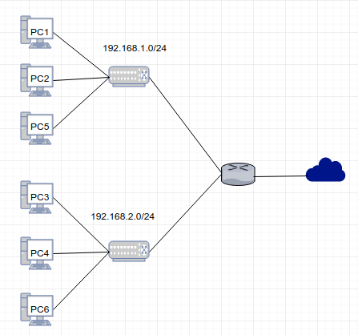
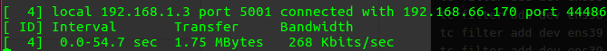
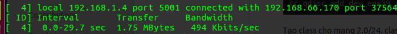
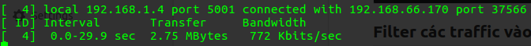
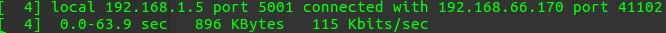
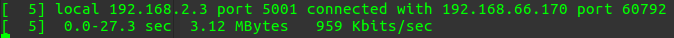
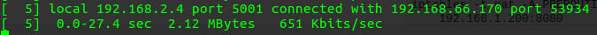
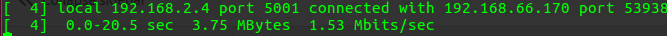
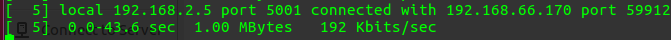

# Mô hình bài lab
  
Mạng nội bộ gồm 2 dải mạng là 192.168.1.0/24 và 192.168.2.0/24. Các IP trong bài lab như sau:  
- Router: ens33 192.168.66.166  
	  ens38 192.168.1.2  
	  ens39 192.168.2.2  
- PC1: 192.168.1.3  
- PC2: 192.168.1.4  
- PC3: 192.168.2.3  
- PC4: 192.168.2.4

Yêu cầu là phải giới hạn bandwidth của các client trong mạng như sau:  
- Dải mạng 192.168.1.0/24 có bandwidth không quá 100KB/s  
- Dải mạng 192.168.2.0/24 có bandwidth không quá 200KB/s  
- PC1 có bandwidth 35KB/s  
- PC2 có bandwidth 50KB/s và bandwidth tối đa là 100KB/s  
- Tất cả các traffic còn lại sẽ có bandwidth không quá 15KB/s  
- PC3 có bandwidth là 125KB/s  
- PC4 có bandwidth là 50KB/s và có bandwidth tối đa là 200KB/s khi class parent có bandwidth  
- Tất cả các traffic còn lại trong mạng 2.0/24 có bandwidth là 25KB/s  

# Cấu hình
Mọi cấu hình trong bài lab đều thực hiện trên Router.  

## Tạo qdisc, class cho mạng 1.0/24
Tạo qdisc htb
```
tc qdisc add dev ens38 root handle 1: htb default 12
```
Tạo class cho mạng 1.0/24, class cho PC1, class cho PC2, class cho trafic mail service PC2, class cho traffic còn lại của PC2 và class dành cho các PC còn lại nằm trong mạng 1.0/24
```
tc class add dev ens38 parent 1: classid 1:1 htb rate 100kbps
tc class add dev ens38 parent 1:1 classid 1:10 htb rate 35kbps
tc class add dev ens38 parent 1:1 classid 1:11 htb rate 50kbps ceil 100kbps
tc class add dev ens38 parent 1:1 classid 1:12 htb rate 15kbps
```

## Tạo qdisc,class cho mạng 2.0/24
Tạo qdisc htb
```
tc qdisc add dev ens39 root handle 2: htb default 22
```
Tạo class cho mạng 2.0/24, class cho PC3, class cho web traffic của PC3, class cho traffic còn lại của PC3, class cho PC4 và class dành cho các PC còn lại nằm trong mạng 2.0/24
```
tc class add dev ens39 parent 2: classid 2:2 htb rate 200kbps
tc class add dev ens39 parent 2:2 classid 2:20 htb rate 125kbps
tc class add dev ens39 parent 2:2 classid 2:21 htb rate 50kbps ceil 200kbps
tc class add dev ens39 parent 2:2 classid 2:22 htb rate 25kbps
```

# Cách 1
## Mark các package bằng iptables
```
iptables -t mangle -A FORWARD -i ens33 -d 192.168.1.3/32 -j MARK --set-mark 1
iptables -t mangle -A FORWARD -i ens33 -d 192.168.1.4/32 -j MARK --set-mark 2
iptables -t mangle -A FORWARD -i ens33 -d 192.168.2.3/32 -j MARK --set-mark 3
iptables -t mangle -A FORWARD -i ens33 -d 192.168.2.4/32 -j MARK --set-mark 4
```

## Filter các traffic vào class
```
tc filter add dev ens38 protocol ip parent 1:0 prio 1 handle 1 fw flowid 1:10
tc filter add dev ens38 protocol ip parent 1:0 prio 1 handle 2 fw flowid 1:11
tc filter add dev ens39 protocol ip parent 2:0 prio 1 handle 3 fw flowid 2:20
tc filter add dev ens39 protocol ip parent 2:0 prio 1 handle 4 fw flowid 2:21
```

# Cách 2
Sử dụng câu lệnh tc filter để lọc package đưa vào class
```
tc filter add dev ens38 parent 1:0 protocol ip prio 1 u32 match ip dst 192.168.1.3/32 flowid 1:10
tc filter add dev ens38 parent 1:0 protocol ip prio 1 u32 match ip dst 192.168.1.4/32 flowid 1:11
tc filter add dev ens39 parent 2:0 protocol ip prio 1 u32 match ip dst 192.168.2.3/32 flowid 2:20
tc filter add dev ens39 parent 2:0 protocol ip prio 1 u32 match ip dst 192.168.2.4/32 flowid 2:21
```
# Test
Tạo 1 Router mô phỏng Internet để test mạng (IP 192.168.66.170)  
Trên Router Internet và các PC cài phần mềm ipert
```
sudo apt-get install -y iperf
```
Trên các client chạy iperf để mô phỏng nhận dữ liệu
```
iperf -s -p port
```
Sử dụng Router Internet để kết nối đến client
```
iperf -c IP_Address
```
PC1 có bandwidth 35KB~280Kb  
  
Test mạng PC2 50KB~400Kb khi parent không có bandwidth  
  
Test mạng PC2 100KB~800Kb khi parent có bandwidth rảnh  
  
Test mạng PC5 khi filter không khớp với rule nào nên có bandwidth 15KB~120Kb  
  
Test mạng PC3 125KB~1000Kb  
  
Test mạng PC4 50KB~400Kb khi parent không có bandwidth  
  
Test mạng PC4 200KB~1600Kb khi parent có bandwidth  
  
Test mạng PC6 không khớp với rule nào nên có bandwidth 25KB~200Kb  
  

